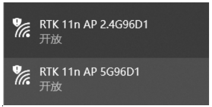
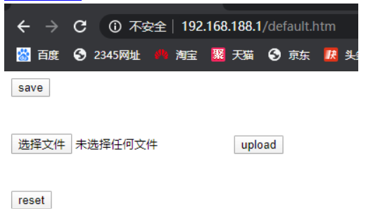
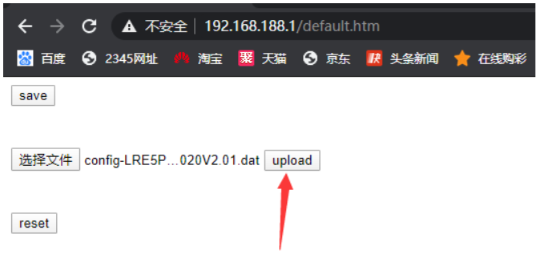
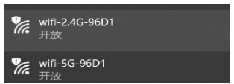
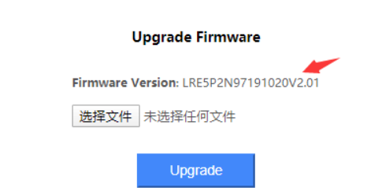

## RTK 11n Extender firmware
[](Image)  


After the repeater restarts, the wireless ssid becomes as shown below  
[](Image)  
Connect to any ssid above  
Open the browser and go to <http://192.168.188.1/default.htm>  
```
User: admin  
Pass: admin  
```
[](Image)  
Select the file [config-LRE5P2N97131020V2.01.dat](https://github.com/gwolf2u/extender_firmware/blob/main/config-LRE5P2N97131020V2.01.dat) click upload and wait 30 seconds for reboot  
[](Image)  
Press and hold the reset button for 8 seconds and release after success. The wireless name is  
[](Image)  
If there is no such SSID, the reset was unsuccessful, so reset again  
Connect to Wifi-5G-96D1, open the browser and enter <http://192.168.188.1> and click Management  
Flash firmware [LRE5P2N97131020V2.01.bin](https://github.com/gwolf2u/extender_firmware/blob/main/LRE5P2N97131020V2.01.bin)  
[](Image)  
This shows that the firmware upgrade was successful
